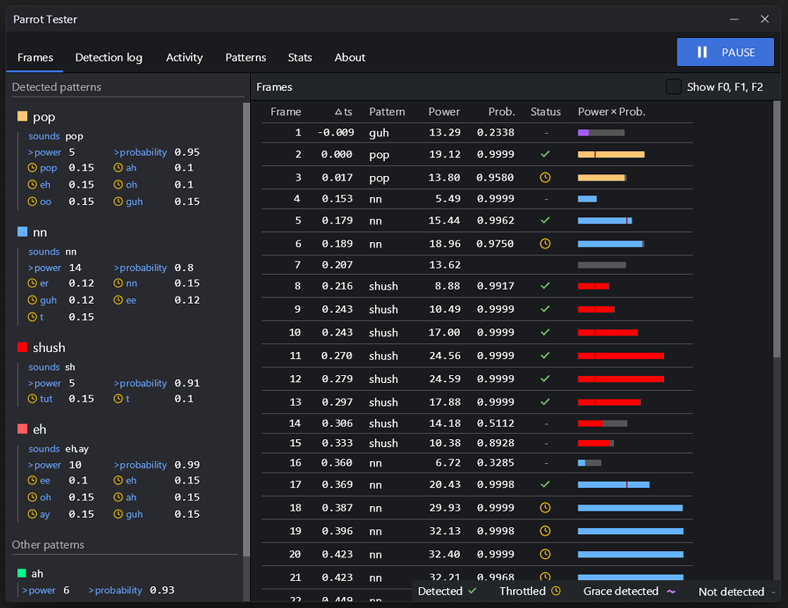

# Parrot Tester

Parrot Tester is a visualization tool to help you analyze your parrot integration with Talon, showing live data for frames, history, activity, and stats, using your existing `parrot_integration.py` and `patterns.json` files.



## Prerequisites
- Talon beta with a working parrot model
- A `parrot_integration.py` file anywhere in your Talon user directory (will be auto discovered)
- A `patterns.json` file anywhere in your Talon user directory (will be auto discovered)
- `talon-ui-elements` v0.9 or greater - https://github.com/rokubop/talon-ui-elements

## Installation

Download or clone this repository into your Talon user directory. This tool depends on version 0.9 or greater of `talon-ui-elements` library for the UI, so we will clone that as well.

```bash
# mac and linux
cd ~/.talon/user

# windows
cd ~/AppData/Roaming/talon/user

# prerequisite
git clone https://github.com/rokubop/talon-ui-elements.git

# clone the Parrot Tester tool
git clone https://github.com/rokubop/parrot_tester.git
```

Done! You can now use the Parrot Tester tool. 🎉

Say "parrot tester" to toggle the UI and start testing!

## Known Limitations
**Folder names with dashes:** Parrot Tester cannot work with `parrot_integration.py` files located in directory paths containing dashes (e.g., `my-folder/parrot_integration.py`).

**Options:** Either rename folders containing dashes to use underscores, or move your `parrot_integration.py` file to a different location that does not contain dashes.
- Example: `my-folder/parrot_integration.py` → `my_folder/parrot_integration.py`

If you change a folder name, you may also need to update your `parrot_integration.py` file to point to new paths.

## How it works

A spy is attached to your existing `parrot_integration.py` file upon UI launch, and restored when the UI is closed.

No destructive edits are done to your `parrot_integration.py` or `patterns.json`.

If you somehow get into an error state, a Talon restart will restore everything to normal.

## Grace thresholds not working

If grace thresholds are not working as expected, you may want to try changing these lines in your `parrot_integration.py`. This bug was discovered as I was testing this tool.

Before:
```python
throttles = {}
if 'throttle' in pattern:
    if name not in pattern['throttle']:
        pattern['throttle'][name] = 0
    throttles = pattern['throttle']
```

After:
```python
throttles = {}
if 'throttle' in pattern:
    # if name not in pattern['throttle']:
    #     pattern['throttle'][name] = 0
    throttles = pattern['throttle']
```

Grace thresholds should now work as expected, but you may need to manually add "throttle" to every pattern now.